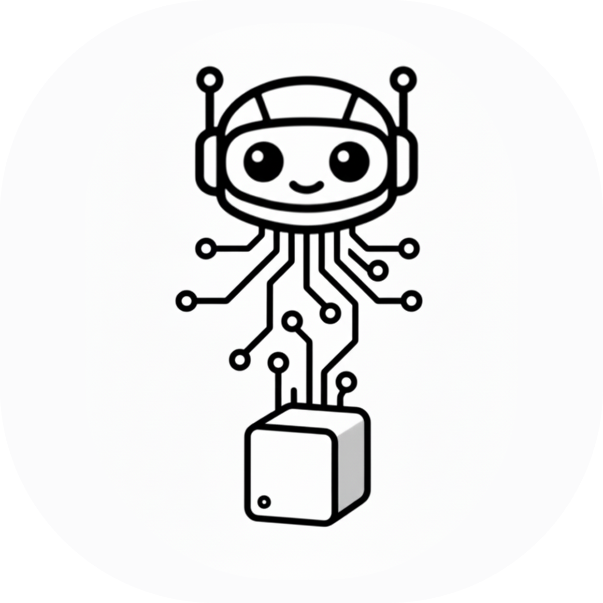

# Daemon

  

**Daemon** is a personal assistant bot that runs entirely on your own hardware while leveraging powerful, scalable open cloud APIs. Rather than hosting bulky hardware, Daemon connects securely to the **OpenRouter API** to dynamically route tasks to the best cloud LLMs based on task complexity (e.g. Gemini 2.5 Flash for speed, Claude 3.5 Sonnet for depth).

**We recommend using the [Daemon Desktop](https://github.com/niiyeboah/daemon/releases) app** to chat with Daemon from a native window. [Download for macOS, Windows & Linux](https://github.com/niiyeboah/daemon/releases) · [Setup guide](https://niiyeboah.github.io/daemon/)

## Table of contents

- [Daemon](#daemon)
  - [Table of contents](#table-of-contents)
  - [Stack](#stack)
  - [What You Get](#what-you-get)
  - [Setup Guides](#setup-guides)
  - [Prerequisites](#prerequisites)
  - [License](#license)

## Stack

| Layer             | Component                                                                                                                                                                        |
| ----------------- | -------------------------------------------------------------------------------------------------------------------------------------------------------------------------------- |
| Hardware          | [M4 Mac Mini](docs/01-hardware.md) or [Beelink S13 Pro](docs/01-hardware.md)                                                                     |
| Operating System  | [OS Setup](docs/02-os-setup.md) — macOS, Windows, Ubuntu Desktop |
| Inference Runtime | Cloud API Inference ([OpenRouter](https://openrouter.ai/keys))                                                                                                                                                |
| Language Model    | Dynamic Model Routing (Gemini 2.5 Flash, Claude 3.5 Sonnet, etc.) |

## What You Get

After following the guides below you will have:

- A lightweight application connecting to the best cloud LLMs securely.
- Dynamic task complexity routing (e.g. choose "Simple Task" to use faster models or "Complex Task" for sophisticated reasoning).
- A personal assistant named **Daemon** reachable via the [Daemon Desktop](https://github.com/niiyeboah/daemon/releases) app from any device.

For a low-power always-on gateway, the **Beelink S13 Pro** (Windows preloaded) is a great option. See [Hardware](docs/01-hardware.md). Alternatively, install [Ubuntu Desktop](docs/02-os-setup.md#ubuntu-desktop-beelink-s13-pro) on Beelink if you prefer Linux.

## Setup Guides

Read these in order. Each guide picks up where the previous one left off.

| #   | Guide                                                   | Description                                                              |
| --- | ------------------------------------------------------- | ------------------------------------------------------------------------ |
| 1   | [Hardware](docs/01-hardware.md)                         | M4 Mac Mini (local) and Beelink S13 Pro (cloud API option)               |
| 2   | [OS Setup](docs/02-os-setup.md)                         | macOS (default), Windows, or Ubuntu Desktop — get your OS ready         |
| 3   | [OpenRouter API Accounts](docs/03-openrouter-setup.md)   | Creating your OpenRouter API Keys to allow the Daemon to speak   |
| 4   | [Security](docs/04-security.md)                         | Firewall, SSH hardening, and automatic updates                           |
| 5   | [Troubleshooting](docs/05-troubleshooting.md)            | Common issues and how to fix them                                        |
| 6   | [Next Steps](docs/06-next-steps.md)                     | Ideas for extending Daemon (voice, integrations, web UI)                 |
| 7   | [OpenClaw & automation](docs/07-openclaw-automation.md) | Set up OpenClaw, automate tasks, and use Daemon like a personal employee |

## Prerequisites

- An OpenRouter API Key (retrieve one at [openrouter.ai/keys](https://openrouter.ai/keys)).
- A machine to run the daemon desktop application (any macOS, Windows, or Linux GUI).

## License

This documentation is provided as-is for personal use. See individual tool and model licenses for their respective terms.
